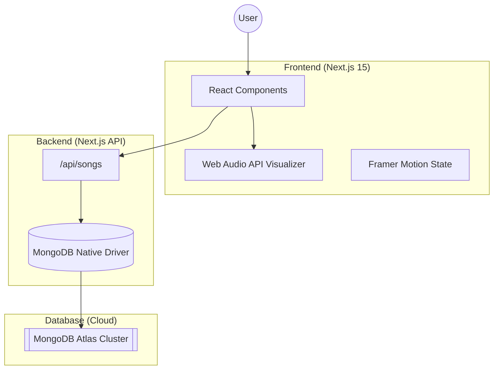

# 🎵 RhythmX — Premium Audio Visualizer


RhythmX is a high-performance, real-time music visualizer built with **Next.js 15**, **MongoDB Atlas**, and the **Web Audio API**. It delivers a premium, immersive listening experience with fluid wave animations and cloud-synced playlists.

## 🚀 Key Features

- **Real-time Wave Visualizer**: Dynamic audio analysis with smooth, organic wave animations.
- **Cloud-Managed Playlist**: Automatically synced music library powered by MongoDB Atlas.
- **Local Music Upload**: Supports temporary drag-and-drop MP3 playback with instant visualization.
- **Professional UI**: Minimalist, dark-mode design with smooth framer-motion transitions.
- **Elastic Controls**: Premium UI components like elastic sliders for track seeking.

---

## 🏗️ System Architecture

RhythmX follows a modern, serverless-first architecture optimized for performance and reliability.



### ⚙️ Workflow Details

1.  **Request Flow**: When a user opens the app, the frontend sends a `GET` request to `/api/songs`.
2.  **Database Connection**: The Next.js API uses a **MongoDB Singleton Client** with connection pooling to maximize performance in serverless environments.
3.  **Audio Processing**: Once a song is selected, the **MediaElementSourceNode** connects the audio to an **AnalyserNode**, which extracts real-time frequency data.
4.  **Visualization**: This frequency data is mapped to CSS/Motion properties to create the signature wave effect.

---

## 🛠️ Tech Stack

- **Framework**: Next.js 15 (Turbopack)
- **Styling**: Tailwind CSS & Framer Motion
- **Database**: MongoDB Atlas (Native Driver)
- **State & Logic**: React Hooks & Web Audio API
- **Deployment**: Vercel

---

## 📦 Getting Started

### 1. Prerequisites

- Node.js 18+
- A MongoDB Atlas Connection String

### 2. Setup

Clone the repository and install dependencies:

```bash
git clone https://github.com/CodeWithBasu/RhythmX.git
cd RhythmX
npm install
```

### 3. Environment Variables

Create a `.env` file in the root:

```env
DATABASE_URL="your_mongodb_atlas_connection_string"
```

### 4. Seed the Database

Push the initial song list to your MongoDB cluster:

```bash
npx tsx scripts/seed.ts
```

### 5. Run the Project

```bash
npm run dev
```

---

## 📄 License

This project is licensed under the MIT License - see the [LICENSE](LICENSE) file for details.

Developed with ❤️ by [CodeWithBasu](https://github.com/CodeWithBasu)
