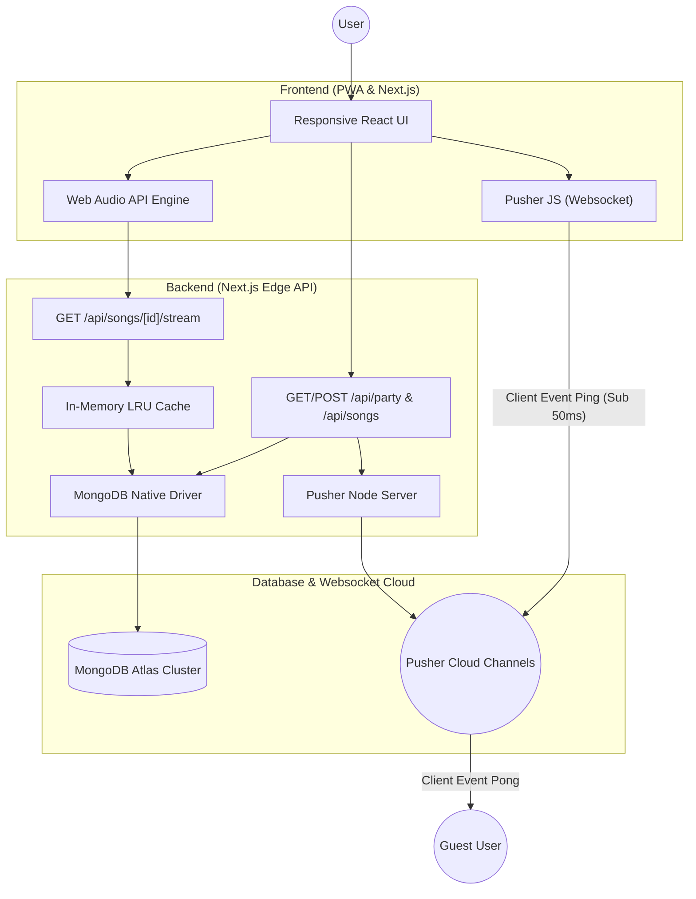

# 🎵 RhythmX — Premium Audio Visualizer App


RhythmX is a high-performance, real-time music visualizer and Progressive Web App (PWA) built with **Next.js 16 (Canary)**, **MongoDB Atlas**, **Pusher**, and the **Web Audio API**. It delivers a premium, immersive listening experience with fluid, responsive wave animations, server-cached audio streaming, and ultra-low latency multi-device synchronization.

## 🚀 Key Features

- **Real-Time Party Sync**: Listen together with friends in perfect harmony! By utilizing Pusher's WebSockets and direct Client-Events, playback state changes (play, pause, scrub) are beamed directly to all connected guests with <50ms latency, completely bypassing server processing delays.
- **Audiophile Calibration**: Guests have access to a dedicated Manual Sync Adjustment slider (-500ms to +500ms) to calibrate and offset invisible hardware decoding or Bluetooth speaker lag, achieving true zero-echo acoustic parity.
- **Progressive Web App (PWA)**: Install RhythmX directly to your iOS or Android home screen, or as a desktop app, complete with a custom app icon and offline-ready standalone UI.
- **Real-time Wave Visualizer**: Dynamic audio analysis with smooth, organic wave animations that adapt mathematically to your device's screen size using native CSS flex-box scaling.
- **High-Speed Audio Streaming**: Utilizes a custom `/api/songs/[id]/stream` endpoint with an advanced LRU Memory Cache to stream binary audio instantly, minimizing base64 decoding delays and eliminating UI freezes.
- **Cloud-Managed Playlist**: Automatically synced music library powered by MongoDB Atlas. Add songs directly via URL or local file upload.
- **Secure Admin Dashboard**: A protected `/admin` route requiring a master password to manage, delete, and monitor your cloud MongoDB music database securely.

---

## 📱 Responsive & Adaptive Design

RhythmX monitors the viewport in real-time, intelligently organizing the Web Audio API visualizer using fluid `%` heights and Flexbox layouts rather than fixed pixels, preventing UI bleeding and overlaps:

- **Mobile Phone**: 48 rendered visualization bars for optimal battery performance.
- **Tablet**: 64 rendered visualization bars.
- **Desktop**: 80 rendered visualization bars.

---

## 🏗️ System Architecture

RhythmX follows a modern, serverless-first architecture optimized for performance and reliability.



### ⚙️ Workflow Details

1.  **Request Flow**: Upon opening the app, the frontend sends a `GET /api/songs` request for track metadata instantly (stripped of heavy audio payload).
2.  **Streaming & Caching**: When a user clicks play, the visualizer requests the audio stream. The server checks its RAM (LRU Cache). If it's a cache miss, it streams from MongoDB, caches it locally, and sends binary chunks to the active browser context.
3.  **Visualization**: This frequency data is mapped to framer-motion properties to create the signature wave effect.
4.  **Party Sync**: The host's app directly beams playstate payloads to Pusher over 'private-party' channels. Guests receive these websocket payloads and mathematically adjust the HTML5 Audio `currentTime` offset by their custom Sync Calibration setting.

---

## 🛠️ Tech Stack

- **Framework**: Next.js 16 (App Router + Turbopack)
- **Styling**: Vanilla CSS, Tailwind CSS & Framer Motion
- **Database**: MongoDB Atlas (Native Node Driver)
- **Real-Time Engine**: Pusher
- **State & Logic**: Custom React Hooks & Web Audio API
- **Cache**: `lru-cache`
- **Deployment**: Vercel

---

## 📦 Getting Started

### 1. Prerequisites

- Node.js 18+
- A MongoDB Atlas Connection String
- A Pusher Application Account

### 2. Setup

Clone the repository and install dependencies:

```bash
git clone https://github.com/CodeWithBasu/RhythmX.git
cd RhythmX
npm install
```

### 3. Environment Variables

Create a `.env` file in the root. You must configure your secure admin password, database, and Pusher API credentials.

```env
DATABASE_URL="your_mongodb_atlas_connection_string"
ADMIN_PASSWORD="your_secure_password"

# Pusher Credentials
PUSHER_APP_ID="your_pusher_app_id"
NEXT_PUBLIC_PUSHER_KEY="your_pusher_key"
PUSHER_SECRET="your_pusher_secret"
NEXT_PUBLIC_PUSHER_CLUSTER="your_pusher_cluster"
```

*Note: In your Pusher App settings, you MUST toggle "Enable client events" ON for the Private Party sync to function.*

### 4. Run the Project

```bash
npm run dev
```

---

## 📄 License

This project is licensed under the MIT License - see the [LICENSE](LICENSE) file for details.

Developed with ❤️ by [CodeWithBasu](https://github.com/CodeWithBasu)
