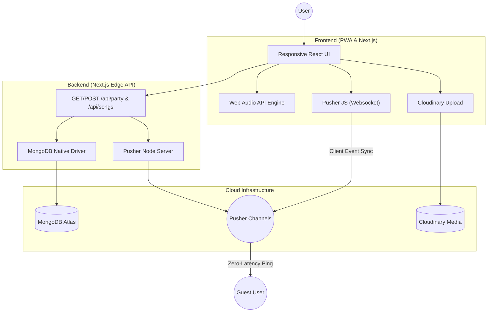

# 🎵 RhythmX — Premium Audio Visualizer App


RhythmX is a high-performance, real-time music visualizer built with **Next.js 16**, **MongoDB**, **Pusher**, and **Cloudinary**. It features ultra-low latency synchronization and high-fidelity neon visuals.

## 🚀 Key Features

- **Real-Time Party Sync**: Zero-latency playback alignment (<50ms) using Pusher Client Events.
- **High-Capacity Storage**: Bypasses Vercel's 4.5MB limit using direct Cloudinary binary uploads.
- **Dynamic Neon Visualizer**: Real-time HSL frequency mapping for immersive, glowing waves.
- **Social Interaction**: Instant floating emoji reactions that sync across all connected devices.
- **Progressive Web App (PWA)**: Installable on iOS, Android, and Desktop with full-screen support.

---

## ⚡ Technical Code Snippets

### 1. Zero-Latency Party Sync (Pusher)
We use Pusher's `client-events` to bypass the server entirely for sub-50ms synchronization across devices.

```typescript
// Unified sync beam for play, pause, and seek events
const sendSyncEvent = (action: string, time: number) => {
  if (partyChannelRef.current && isHost) {
    partyChannelRef.current.trigger('client-sync', {
      action,
      time,
      senderId: myUserId
    });
  }
};
```

### 2. High-Capacity Cloudinary Upload
To bypass the 4.5MB Vercel Serverless limit, we stream binary files directly from the browser to Cloudinary.

```typescript
const uploadToCloud = async (file: File) => {
  const formData = new FormData();
  formData.append('file', file);
  formData.append('upload_preset', 'rhythmx_unsigned');
  
  const response = await fetch(`https://api.cloudinary.com/v1_1/${cloudName}/upload`, {
    method: 'POST',
    body: formData
  });
  const data = await response.json();
  return data.secure_url; // Returns the permanent cloud link
};
```

### 3. Dynamic Neon Visualizer Logic
Maps raw audio frequency data to a smooth color-blended gradient with organic glowing blooms.

```typescript
const getBarColors = (index: number, total: number, height: number, isPlaying: boolean) => {
  // Map frequency position to vibrant HSL color wheel
  const hue = (index / total) * 360;
  const intensity = height / 100; // 0 to 1
  
  return {
    bg: isPlaying ? `hsla(${hue}, 80%, 65%, ${0.3 + intensity * 0.7})` : 'rgba(255,255,255,0.1)',
    glow: isPlaying ? `0 0 ${15 * intensity}px hsla(${hue}, 80%, 65%, 0.5)` : 'none'
  };
};
```

---

## 🏗️ System Architecture
... [Keep existing mermaid diagram] ...


---

## 🛠️ Tech Stack

- **Framework**: Next.js 16 (App Router + Turbopack)
- **Styling**: Vanilla CSS, Tailwind & Framer Motion
- **Database**: MongoDB Atlas
- **Storage**: Cloudinary (Large Media)
- **Real-Time**: Pusher (Pub/Sub)
- **Deployment**: Vercel

---

## 📦 Getting Started

### Quick Start
1.  `npm install`
2.  Set up your `.env` (MongoDB, Pusher, Cloudinary).
3.  `npm run dev`

---

## 📄 License
MIT License. Developed with ❤️ by [CodeWithBasu](https://github.com/CodeWithBasu)
